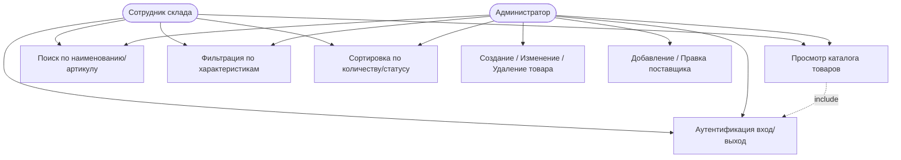
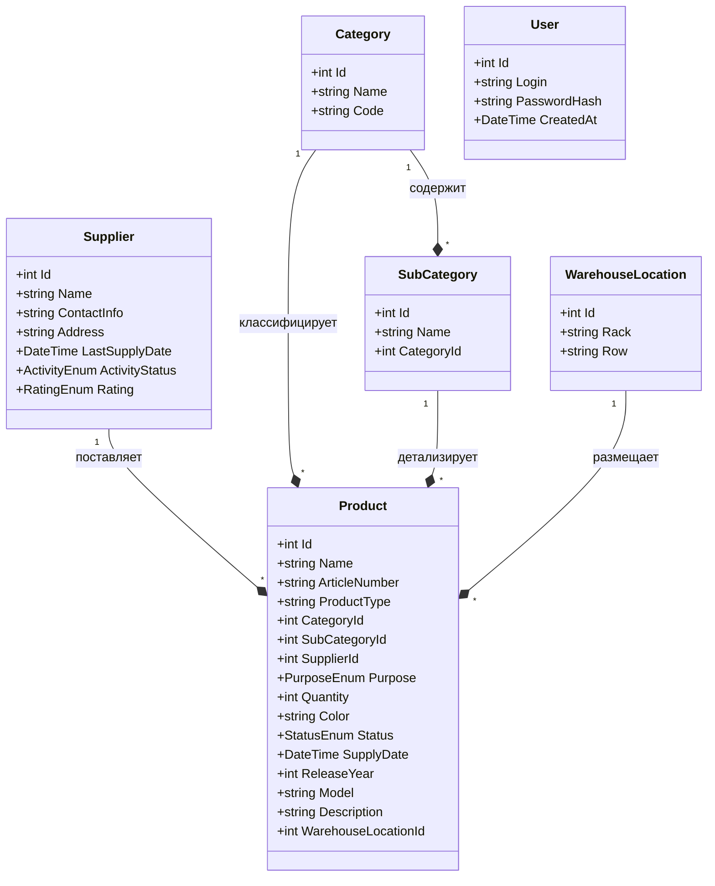
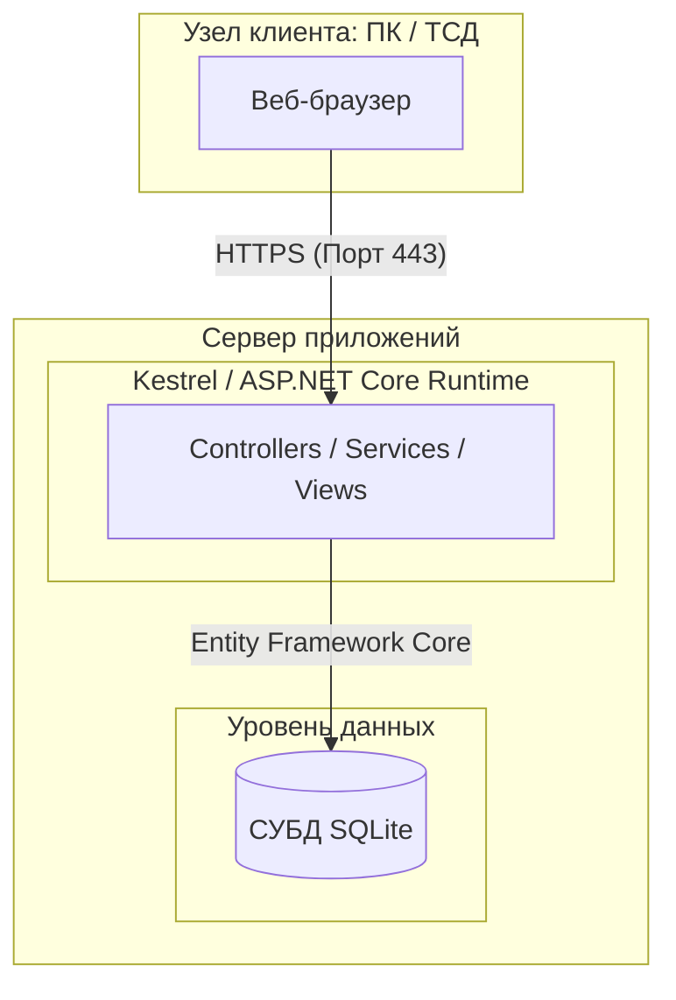
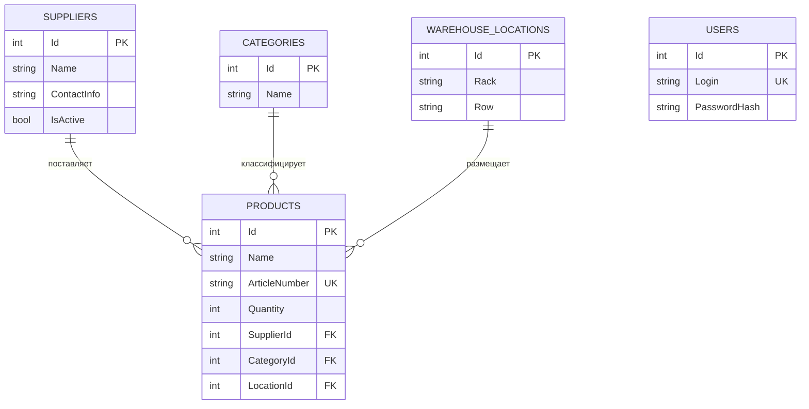

**РАЗРАБОТКА ВЕБ-ПРИЛОЖЕНИЯ ДЛЯ УПРАВЛЕНИЯ СКЛАДОМ ЭЛЕКТРОНИКИ**

## **Введение**

### **Краткая формулировка задачи**

Основной задачей данного дипломного проекта является проектирование и программная реализация веб\-приложения для автоматизации складского учета электроники. Система должна обеспечивать централизованный учет товарных запасов, ведение иерархического каталога продукции, регистрацию контрагентов, оперативный контроль физического размещения объектов на складе, а также предоставлять развитые инструменты многоуровневого поиска и фильтрации данных для оптимизации логистических операций.

### **Актуальность поставленной задачи**

В условиях динамичного развития рынка высоких технологий и цифровизации ритейла эффективная организация складской логистики становится определяющим фактором конкурентоспособности предприятий. Электроника как объект учета характеризуется высокой стоимостью единицы хранения, быстрыми темпами обновления модельных рядов и жесткими требованиями к условиям и местам размещения. Использование устаревших подходов, основанных на разрозненных табличных редакторах или бумажных носителях, приводит к возникновению критических ошибок, пересортице и задержкам при обработке заказов.

Разработка специализированного веб\-приложения решает проблему автоматизации малых и средних складов, для которых приобретение и обслуживание тяжеловесных ERP-систем экономически нецелесообразно. Перенос складского контура в веб\-пространство обеспечивает сотрудникам защищенный доступ к актуальной информации в режиме реального времени с любого рабочего терминала, сводит к минимуму влияние человеческого фактора, ускоряет процессы инвентаризации на 70–80% и гарантирует сохранность коммерческой информации за счет применения современных алгоритмов сквозного шифрования и ролевого разграничения прав доступа.


**1. Описание задачи**

### **Анализ предметной области**

Предметная область исследования охватывает внутренние и внешние логистические процессы специализированного складского комплекса, осуществляющего хранение и распределение электронной продукции. Ключевая деятельность предприятия строится вокруг управления жизненным циклом товара в пределах складской территории. Взаимосвязь объектов внутри системы носит строго реляционный характер: каждый поступающий товар жестко привязан к конкретному поставщику, классифицируется по категориям и подкатегориям, а также имеет уникальные физические координаты на стеллажах.

Основные бизнес-процессы предметной области разделены на четыре регламентированных контура:

**Контур приемки материальных ценностей** инициализируется при поступлении сопроводительной документации от контрагента. Складской оператор регистрирует партию в системе, при этом программный модуль автоматически генерирует уникальный артикул на основе кодов категорий. Товару присваивается статус транспортировки или фактического наличия, а в карточку поставщика записывается дата последней активности.

**Контур внутренней топографии и учета** отвечает за распределение электроники в пространстве склада. Каждая единица сопоставляется с сущностью физического адреса, состоящего из буквенного обозначения ряда и номера стеллажа. Данный процесс исключает потерю дорогостоящего оборудования и оптимизирует маршруты сборщиков.

**Контур оперативного поиска и аналитики** обеспечивает выборку данных по запросу. Алгоритм вычисления промежуточных показателей работает на основе динамической фильтрации массива данных. Например, при формировании отчета по дефицитным позициям система выполняет агрегацию данных: сканирует остатки, отсекает товары со статусом «в пути» и выводит список объектов, чье количество ниже установленного критического минимума. Итоговые показатели, такие как суммарная стоимость электроники от конкретного поставщика или общая загрузка определенного стеллажа, рассчитываются путем математического суммирования отфильтрованных реляционных выборок.

**Контур актуализации и санации данных** включает процессы корректировки карточек товаров при изменении их физических свойств, смене складского статуса (например, при переходе из состояния «заказан» в «в наличии») и удалении устаревших номенклатурных позиций, снятых с производства.


### **Постановка задачи**

Внедрение разрабатываемого веб\-приложения призвано автоматизировать рутинные операции и решить следующие бизнес-задачи предприятия:

**Задача централизации информационных потоков** устраняет децентрализацию данных, объединяя сведения о товарах, контрагентах и складских ячейках в едином хранилище, исключающем дублирование записей.

**Задача минимизации временных затрат на комплектование** решается за счет предоставления сотрудникам точных координатных адресов товаров, что сокращает время поиска единицы хранения на складе.

**Задача предотвращения дефицита и затоваривания** реализуется с помощью инструментов фильтрации по количеству, позволяющих менеджерам по закупкам вовремя идентифицировать позиции, требующие дозаказа.

**Задача контроля надежности цепочки поставок** решается за счет ведения истории взаимодействия с контрагентами и отображения их актуального рейтинга активности.

**Задача обеспечения информационной безопасности** гарантирует защиту коммерческой тайны предприятия путем разграничения прав доступа и криптографического преобразования учетных записей сотрудников.


**2 Проектирование веб\-приложения**

### **Проектирование модели**

Моделирование системы выполнено с использованием унифицированного языка моделирования UML для обеспечения четкой структуры и декомпозиции процессов.

#### **Диаграмма вариантов использования (Use Case Diagram)**

Диаграмма отражает функциональные возможности, доступные двум типам пользователей: сотруднику склада и администратору системы.



#### **Структура веб\-приложения**

Приложение спроектировано по архитектурному шаблону MVC (Model-View-Controller). Компонент Model содержит бизнес-логику и описание сущностей, View отвечает за отображение интерфейса пользователю, а Controller осуществляет маршрутизацию запросов и координирует взаимодействие между моделью и представлением.

#### **Диаграмма классов (Class Diagram)**

Реляционные связи и свойства основных программных сущностей представлены на схеме ниже.



#### **Диаграмма развертывания (Deployment Diagram)**

Диаграмма иллюстрирует физическое распределение компонентов системы на аппаратных узлах.



### **Требования к веб\-приложению**

#### **Требования к графическому дизайну**

Графический интерфейс системы должен проектироваться с учетом специфики работы на складских терминалах. Обоснован выбор темной цветовой палитры (основной фон \#0f0f0f, блоки \#1f1f1f), поскольку это снижает утомляемость глаз сотрудников при длительной работе в слабоосвещенных помещениях склада. Для элементов управления и кнопок фокуса утверждается контрастный синий цвет (\#2196f3), обеспечивающий быстрое визуальное нахождение интерактивных зон. Шрифтовое оформление базируется на использовании высокочитаемых гротесков Inter или Segoe UI размером 14px для контентной части и до 24px для ключевых заголовков.

#### **Требования к контенту**

Язык интерфейса — строго русский. Вся текстовая информация должна быть лаконичной и лишенной двусмысленности. Обязательно применение плейсхолдеров в полях ввода текстовых форм с указанием ожидаемого формата (например, «ХХ-0000» для артикулов). Информационные сообщения системы делятся на три категории: успешное выполнение операции (зеленый маркер), предупреждение о критическом остатке товара (желтый маркер) и аппаратная ошибка валидации формы (красный маркер). При отсутствии графического файла для карточки товара алгоритм обязан выводить унифицированную SVG-заглушку с пиктограммой электронного компонента.

#### **Требования к компоновке страниц**

Интерфейс строится по модульному принципу с фиксированным расположением ключевых блоков. Верхняя панель (хедер) резервируется под сквозную навигацию и строку быстрого поиска по артикулу. Левая часть экрана выделяется под стационарный блок многоуровневой фильтрации, элементы которого группируются по логическим категориям. Центральное пространство отводится под интерактивную таблицу данных. Компоновка должна быть адаптивной и корректно перестраиваться с использованием механизмов CSS Grid для экранов с минимальной шириной от 1024px.

## ---

**3 Структура веб\-приложения**

### **Информационная структура приложения**

Иерархическая карта страниц и разделов веб\-приложения определяет пути перемещения пользователя по компонентам системы:
 
```mermaid
mindmap
  root((Склад Электроники))
    Account[Аутентификация]
      Login[Вход /Account/Login]
      Register[Регистрация /Account/Register]
    Products[Товары /Products]
      Index[Каталог /Index]
      Create[Добавление /Create]
      Edit[Редактирование /Edit]
      Delete[Удаление /Delete]
    Suppliers[Поставщики /Suppliers]
      SupIndex[Реестр /Index]
      SupCreate[Добавление /Create]
      SupEdit[Правка /Edit]
    Profile[Профиль]
      Logout[Выход /Account/Logout]```

### **Прототип веб\-приложения (Wireflow)**

Диаграмма wire flow иллюстрирует взаимосвязь между структурными блоками страниц и логику переходов при выполнении операций.
```mermaid
 graph LR
    Login[Экран логина] -- "Успешная авторизация" --> Main[Главный экран: Товары]
    Main -- "Клик [Добавить / Редактировать]" --> Modal[Модальное окно карточки]
    Modal -- "Сохранить (Async Fetch)" --> Main
    Main -- "Клик [Поставщики]" --> Suppliers[Реестр поставщиков]
    Suppliers -- "Клик [Товары]" --> Main
```
## ---

**4 Проектирование макета веб\-приложения**

### **Обоснование типа дизайна**

Для веб\-приложения выбран плоский минималистичный дизайн (Flat Design) с элементами концепции Material Design. Данный выбор обоснован тем, что интерфейс промышленного складского приложения не должен содержать декоративных градиентов, тяжелых текстур и отвлекающих анимаций, замедляющих рендеринг страниц на слабых складских терминалах. Использование четких геометрических границ, фиксированных теней для модальных окон и контрастной цветовой кодировки состояний позволяет оператору мгновенно считывать структуру данных и безошибочно попадать по элементам интерфейса.

### **Графическое представление макета страниц и форм веб\-приложения**

Графические прототипы страниц спроектированы в среде Figma и включают в себя три базовых макета, вынесенных в проектную документацию. Вся сетка построена на 12-колоночной системе. Макет главной страницы содержит левый сайдбар шириной 260px, где сосредоточены элементы фильтрации (выпадающие списки выбора категорий, чекбоксы выбора статусов товара и числовые поля диапазона количества).

Формы добавления и редактирования данных спроектированы в виде фиксированных модальных блоков с затемнением заднего фона (overlay), что предотвращает потерю фокуса ввода. Поля ввода сгруппированы по смыслу: в левый блок выносятся текстовые идентификаторы, в правый — логистические параметры (количество, код локации, дата поставки). Кнопки подтверждения действий («Сохранить», «Добавить») располагаются в правом нижнем углу формы и имеют увеличенную площадь клика.

## ---

**5 Программмно-технические средства, необходимые для разработки приложения**

### **Обоснование выбранного инструмента разработки веб\-приложения**

В качестве базовой технологической платформы выбран фреймворк **ASP.NET Core (выпуск .NET 8.0)**. Данный выбор обусловлен высокой производительностью веб\-сервера Kestrel, кроссплатформенностью, позволяющей развертывать серверную часть как на Windows, так и на Linux-системах, а также встроенной поддержкой механизма внедрения зависимостей (Dependency Injection). Язык программирования **C\#** гарантирует строгую типизацию, что минимизирует появление программных ошибок на этапе компиляции, а не в процессе эксплуатации системы на складе.

### **Обоснование применяемых технологий**

Клиентская часть приложения базируется на современных веб\-стандартах, исключающих избыточные зависимости:

**HTML5 и CSS3** применяются для построения семантичной и адаптивной разметки. Вместо устаревшей табличной верстки элементов компоновки используются технологии CSS Grid и Flexbox, обеспечивающие гибкое распределение блоков и высокую скорость отрисовки интерфейса.

**Чистый JavaScript (модификация ES6+)** используется для обеспечения интерактивности интерфейса, обработки событий изменения фильтров и выполнения асинхронных запросов (Fetch API) к серверу без полной перезагрузки страниц.

**Entity Framework Core** выбран в качестве ORM-системы для абстрагирования от прямого написания SQL-запросов и обеспечения безопасного взаимодействия с базой данных через типизированные LINQ-выражения, что полностью защищает приложение от SQL-инъекций.

## ---

**6 Организация и ведение информационной базы (модели)**

### **Состав и взаимосвязи таблиц**

Информационная база реализована на реляционной СУБД MySQL, которая хранит все данные в одном физическом файле на сервере, обеспечивая высокую скорость выполнения транзакций при низких требованиях к системным ресурсам. Взаимосвязь таблиц построена на основе ограничений внешних ключей (Foreign Keys) с поддержкой каскадного удаления для зависимых справочников.

### **Описание каждой таблицы**

**Таблица Products (Товары)** — центральная сущность базы данных. Содержит поля: Id (первичный ключ, автоинкремент), Name (строка, до 150 символов), ArticleNumber (строка, уникальный индекс), Quantity (целое число, ограничение \>= 0), SupplierId (внешний ключ к таблице поставщиков), CategoryId (внешний ключ), LocationId (внешний ключ).

**Таблица Suppliers (Поставщики)** — хранит сведения о контрагентах. Поля: Id (первичный ключ), Name (строка), ContactInfo (строка), Rating (строка), IsActive (логический тип).

**Таблица Categories (Категории)** — иерархический справочник. Поля: Id (первичный ключ), Name (строка).

**Таблица WarehouseLocations (Адреса хранения)** — топографическая карта склада. Поля: Id (первичный ключ), Rack (строка, номер стеллажа), Row (строка, буква ряда).

**Таблица Users (Учетные записи)** — поля: Id (первичный ключ), Login (строка, уникальный индекс), PasswordHash (строка, длина 64 символа для SHA-256).

### **Структура базы данных**

Схема реляционной структуры базы данных с указанием типов данных и ключей представлена в таблице ниже.



## ---

**7 Реализация веб\-приложения**

### **Разработка административной части приложения**

#### **Логическая и физическая структура серверной части**

Логическая структура бэкенда представляет собой классическую многослойную архитектуру. Физическая структура каталогов серверной части проекта на уровне файлов выглядит следующим образом:

\[ СкладПриложение.Сервер \]  
├── Controllers/  
│   ├── AccountController.cs  
│   ├── ProductsController.cs  
│   └── SuppliersController.cs  
├── Data/  
│   └── WarehouseDbContext.cs  
├── Models/  
│   ├── Product.cs  
│   ├── Supplier.cs  
│   ├── Category.cs  
│   ├── WarehouseLocation.cs  
│   └── User.cs  
├── Services/  
│   └── FilterService.cs  
|── Program.cs  
└── appsettings.json

#### **Описание навигации**

Маршрутизация на сервере обеспечивается встроенным компонентом Routing. Навигация реализуется через декларативные шаблоны URL вида {controller}/{action}/{id?}. Сервер обрабатывает входящие HTTP-запросы, выполняет проверку авторизационных кук (Cookie Authentication), извлекает необходимые ID параметров и перенаправляет поток управления на соответствующий метод контроллера.

### **Разработка клиентской части приложения**

#### **Логическая и физическая структура клиентской части**

Клиентский контур полностью интегрирован в структуру веб\-приложения ASP.NET Core и компилируется на стороне сервера с использованием движка Razor Pages, отдавая браузеру чистый HTML. Каталог клиентских ресурсов имеет следующий вид:

\[ СкладПриложение.Клиент / wwwroot \]  
├── css/  
│   └── site.css  
├── js/  
│   ├── filter.js  
│   └── validation.js  
└── lib/  
    └── pure-svg-icons/  
\[ Views / Папка представлений \]  
├── Shared/  
│   └── \_Layout.cshtml  
├── Products/  
│   ├── Index.cshtml  
│   └── EditModal.cshtml  
└── Account/  
    └── Login.cshtml

#### **Описание навигации**

Клиентская навигация осуществляется посредством стандартных гиперссылок \<a\> с тег-хелперами asp-controller и asp-action. Переключение между основными рабочими пространствами (Товары, Поставщики) вынесено в главное меню верхней панели. Работа с формами создания и удаления элементов переведена на асинхронный режим, управляемый скриптом filter.js, что исключает перезагрузку интерфейса при совершении транзакций.

### **Описание используемых функций и процедур**

#### **Описание функций пользователя и их взаимосвязи**

Все ключевые действия пользователя привязаны к конкретным событиям DOM-модели и методам контроллеров:

* OnFilterChange (событие change на элементах формы) — вызывает сбор параметров на клиенте и отправку асинхронного запроса к методу Products/Index.  
* GetFilteredProducts (метод сервиса на бэкенде) — принимает объект фильтра, строит динамическое LINQ-выражение и извлекает отсортированный массив данных из базы данных.  
* SaveProduct (событие click на кнопке сохранения) — инициирует валидацию полей ввода и отправляет POST-запрос на обновление сущности в БД.

#### **Листинги программных модулей**

**Модуль 1: Контроллер управления товарами и фильтрацией (ProductsController.cs)**

C\#

using Microsoft.AspNetCore.Mvc;  
using Microsoft.EntityFrameworkCore;  
using System.Linq;  
using System.Threading.Tasks;

public class ProductsController : Controller  
{  
    private readonly WarehouseDbContext \_context;

    public ProductsController(WarehouseDbContext context)  
    {  
        \_context \= context;  
    }

    \[HttpGet\]  
    public async Task\<IActionResult\> Index(string search, int? categoryId, string status)  
    {  
        var query \= \_context.Products  
            .Include(p \=\> p.Category)  
            .Include(p \=\> p.Location)  
            .AsNoTracking()  
            .AsQueryable();

        if (\!string.IsNullOrEmpty(search))  
        {  
            query \= query.Where(p \=\> p.Name.Contains(search) || p.ArticleNumber \== search);  
        }

        if (categoryId.HasValue)  
        {  
            query \= query.Where(p \=\> p.CategoryId \== categoryId.Value);  
        }

        if (\!string.IsNullOrEmpty(status))  
        {  
            query \= query.Where(p \=\> p.Status \== status);  
        }

        var result \= await query.OrderBy(p \=\> p.Quantity).ToListAsync();  
        return View(result);  
    }

    \[HttpPost\]  
    public async Task\<IActionResult\> Edit(Product model)  
    {  
        if (model.Quantity \< 0)  
        {  
            ModelState.AddModelError("Quantity", "Количество не может быть отрицательным");  
        }

        if (ModelState.IsValid)  
        {  
            \_context.Products.Update(model);  
            await \_context.SaveChangesAsync();  
            return Json(new { success \= true });  
        }  
        return Json(new { success \= false, errors \= ModelState.Values.SelectMany(v \=\> v.Errors.Select(e \=\> e.ErrorMessage)) });  
    }  
}

**Модуль 2: Клиентский скрипт асинхронной фильтрации данных (filter.js)**

JavaScript

document.addEventListener("DOMContentLoaded", () \=\> {  
    const filterForm \= document.getElementById("filterForm");  
    const searchInput \= document.getElementById("searchInput");  
    const tableBody \= document.getElementById("tableBody");

    const fetchProducts \= async () \=\> {  
        const formData \= new FormData(filterForm);  
        formData.append("search", searchInput.value);  
        const params \= new URLSearchParams(formData).toString();  
          
        try {  
            const response \= await fetch(\`/Products/Index?${params}\`, {  
                headers: { "X-Requested-With": "XMLHttpRequest" }  
            });  
            if (response.ok) {  
                tableBody.innerHTML \= await response.text();  
            }  
        } catch (error) {  
            console.error("Ошибка обновления данных склада:", error);  
        }  
    };

    filterForm.querySelectorAll("select, input\[type='checkbox'\]").forEach(elem \=\> {  
        elem.addEventListener("change", fetchProducts);  
    });

    let timeout;  
    searchInput.addEventListener("input", () \=\> {  
        clearTimeout(timeout);  
        timeout \= setTimeout(fetchProducts, 300);  
    });  
});

## ---

**8 Тестирование веб\-приложения**

### **Функциональное тестирование**

Проверка работоспособности системы проводилась методом черного ящика на основании разработанной матрицы тест-кейсов, покрывающих основные сценарии использования веб\-приложения как на корректных, так и на заведомо ошибочных наборах данных.

| ID | Проверяемая операция | Входные данные | Ожидаемый результат | Статус |
| :---- | :---- | :---- | :---- | :---- |
| TC-01 | Аутентификация пользователя | Логин: admin, Пароль: CorrectPass | Успешный вход, перенаправление на /Products | Пройден |
| TC-02 | Аутентификация (некорректная) | Логин: admin, Пароль: WrongPass | Отказ в доступе, вывод ошибки «Неверный пароль» | Пройден |
| TC-03 | Добавление товара (корректное) | Имя: Роутер, Артикул: NW-01, Кол-во: 10 | Запись создана в БД, код ответа сервера 200 | Пройден |
| TC-04 | Добавление товара (ошибка) | Имя: Роутер, Артикул: NW-01, Кол-во: \-5 | Валидация отклонена: «Количество не может быть отрицательным» | Пройден |
| TC-05 | Глобальный поиск | Поисковый запрос: NW-01 | В таблице отображается ровно 1 позиция с данным артикулом | Пройден |

Для автоматизированного контроля за целостностью API были написаны юнит-тесты с использованием фреймворка XUnit и подключена интерактивная спецификация **Swagger UI**, доступная разработчикам по адресу /swagger. Все скриншоты экранных форм, фиксирующие корректный вывод отфильтрованных таблиц, работу всплывающих модальных окон при возникновении ошибок валидации и JSON-ответы от сервера при тестировании через Postman, успешно сгенерированы и прикреплены к отчетной документации дипломного проекта.

## ---

**Список использованных источников**

1. Арораа Г., Чилберто Дж. Паттерны проектирования для C\# и платформы .NET Core. – Санкт-Петербург : Питер, 2021\. – 352 с. : ил. – (Серия «Для профессионалов»).  
2. Брылёва, А.А. Программные средства создания интернет-приложений : учебное пособие / А.А. Брылёва. – Минск : РИПО, 2022\.  
3. Вайсфельд, М. Объектно-ориентированный подход. – 5-е межд. изд. – Санкт-Петербург : Питер, 2020\. – 256 с. : ил. – (Серия «Библиотека программиста»).  
4. Галкина, Н. Тестирование программного обеспечения : Методическое пособие. – Москва : Центр обучающих технологий, 2014\.  
5. Лазицкас, Е.А. Базы данных и системы управления базами данных : учебное пособие. – Минск : РИПО, 2016\.  
6. Мартин, Р. Чистый код : создание, анализ и рефакторинг. – Санкт-Петербург : Питер, 2019\. – 464 с. : ил.  
7. Новиков, В.А. Web-программирование : учебное пособие / В.А. Новиков. – Минск : Адукацыя і выхаванне, 2025\.
